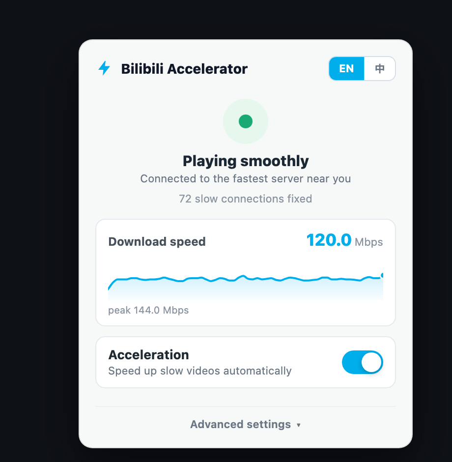
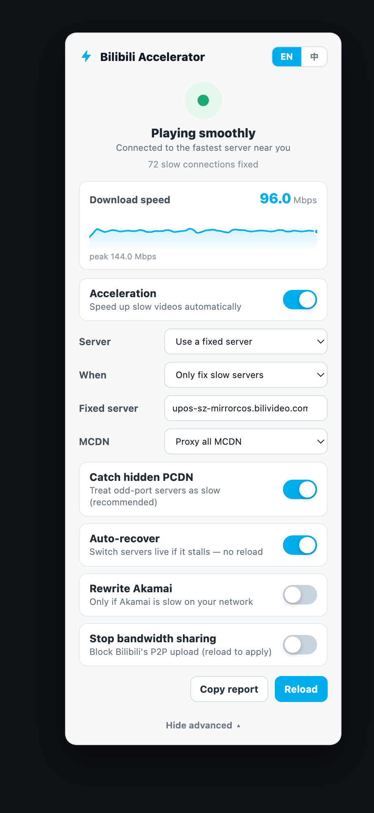

# Bilibili Accelerator

[中文](./README.md)

Bilibili should not buffer every few seconds just because you are watching from overseas.

**Bilibili Accelerator** is a userscript that rewrites slow Bilibili playback CDN URLs before the player starts buffering. It targets the usual overseas pain points: `upos-*ov` mirror hosts, MCDN/PCDN nodes, and route choices that make niche videos stutter while popular videos play fine.

<p align="center">
  
</p>

## Install

Greasy Fork is the recommended install path. It works with Chrome, Safari, Firefox, and Edge through a userscript manager.

- [Greasy Fork script page](https://greasyfork.org/en/scripts/582026-bilibili-accelerator)
- [Direct `.user.js` install](https://update.greasyfork.org/scripts/582026/Bilibili%20Accelerator.user.js)
- [GitHub Raw fallback](https://raw.githubusercontent.com/realzza/bilibili-accelerator/main/dist/bilibili-accelerator.user.js)
- [GitHub Release v0.3.0](https://github.com/realzza/bilibili-accelerator/releases/tag/v0.3.0)

After installation, open any Bilibili video. A small ⚡ icon in the lower-right corner means the script is active.

## Chrome / Edge

1. Install [Tampermonkey](https://www.tampermonkey.net/) or [Violentmonkey](https://violentmonkey.github.io/).
2. Open the [Greasy Fork script page](https://greasyfork.org/en/scripts/582026-bilibili-accelerator).
3. Click Install.
4. Reload the Bilibili video page.

You can also load the unpacked extension:

```sh
npm run build
```

Then open `chrome://extensions`, enable Developer mode, and select `dist/extension`.

## Safari

1. Install the Safari extension [Userscripts](https://apps.apple.com/us/app/userscripts/id1463298887).
2. Enable Userscripts in Safari Settings and allow it on `bilibili.com`.
3. Open the [Greasy Fork script page](https://greasyfork.org/en/scripts/582026-bilibili-accelerator) or the [GitHub Raw fallback](https://raw.githubusercontent.com/realzza/bilibili-accelerator/main/dist/bilibili-accelerator.user.js).
4. Install when prompted, then reload the Bilibili video page.

## What It Changes

Bilibili often returns multiple signed media URLs for the same video. Overseas viewers may get routed to hosts like:

```text
upos-sz-mirrorcosov.bilivideo.com
xy153x35x231x78xy.mcdn.bilivideo.cn:8082
```

The script rewrites those slow paths to steadier playback routes, by default:

```text
upos-sz-mirrorcos.bilivideo.com
proxy-tf-all-ws.bilivideo.com
```

Healthy CDN URLs are left alone by default. For stubborn videos, open the ⚡ panel and tap **Still buffering? Boost harder**.

In web fullscreen the ⚡ icon fades out so it never covers the video; move the cursor to the lower-right corner to bring it back.

## What's New in 0.2

0.2 is a full upgrade focused on catching more slow servers automatically and getting out of your way:

- **Catches Bilibili's newer hidden PCDN** (e.g. `*.edge.mountaintoys.cn`) by treating any odd-port / `os=mcdn` playback server as slow — no hostname allow-list to keep up to date.
- **Covers every request path** — adds `XMLHttpRequest` interception on top of `fetch`, `JSON.parse`, and page globals, so quality switches and bangumi no longer slip through.
- **Picks the fastest server for you** — auto-probes candidate servers and remembers the best one for your region, instead of forcing everyone onto one fixed host.
- **Auto-recovers from stalls** — if playback buffers, it switches servers live, no page reload.
- **Plain-language panel** — one status (Playing smoothly / Finding a faster server), one switch, one "Boost harder" button. Every old knob still lives under **Advanced settings**.
- **Optional bandwidth guard** — stop Bilibili from using your upload via WebRTC P2P (off by default).
- **Toolbar popup + synced settings** for the browser extension.
- **Live speed graph** *(0.2.1, refined in 0.2.2)* — a real-time download-speed chart right in the panel. It measures throughput over the time data is actually flowing, so a fast link reads high and steady instead of flickering to zero between buffer fills. Falls back to buffer health when a CDN hides byte sizes.

<p align="center">
  
</p>

## What's New in 0.2.3

0.2.3 is a correctness and coverage release:

- **Live streams are now safe** — live (`/live-bvc/`) media URLs are never host-swapped or proxied (VOD mirrors can't serve them), and PCDN/MCDN entries are filtered out of the live room's server list so the live player only dials official CDN hosts.
- **Smarter server probing** — probes now read the real HTTP status (a fast-failing server can no longer win the ranking) and abort the download right after timing the response, instead of silently pulling full video segments during each probe.
- **More PCDN families caught** — `upos-*302*` redirect hosts and the residential-node domains they land on, plus PCDN hosts hiding behind mirror-style names.
- **Fewer escapes** — requests made with `URL` objects, protocol-relative URLs, bangumi (`video_info.dash`) payloads, and legacy `durl` playlists are all covered now.
- **Stall recovery that keeps trying** — recovery now tracks the server that actually stalled (not the player's internal blob URL) and keeps rotating while buffering persists instead of switching exactly once.
- **Bandwidth guard hardening** — the opt-in guard also stubs Bilibili's P2P SDK entry points (`PCDNLoader`, `BPP2PSDK`, `SeederSDK`).

## What's New in 0.3.0

0.3.0 is a frontend release — the panel becomes yours to personalize:

- **Accent themes** — pick from six curated accents (Bilibili Blue, Pink, Violet, Emerald, Sunset, Graphite) under **Advanced settings → Accent**. Defaults to the original Bilibili blue, so nothing changes until you choose otherwise.
- **Light / Dark / System surface** — the panel now has a proper dark theme instead of a bright white box on dark pages. **Theme** follows your OS by default and live-updates when the system flips.
- **Under the hood** — every color routes through a small token layer, so accent and surface are one consistent system across the status hero, the live speed chart, switches, and the ⚡ badge.

## Tested Case

This reported stuttery video:

```text
https://www.bilibili.com/video/BV1NnVK6cEXs
```

returned `upos-sz-mirrorcosov.bilivideo.com` playback URLs. The script rewrites them to `upos-sz-mirrorcos.bilivideo.com`.

## Development

```sh
npm test
npm run build
```

Outputs:

```text
dist/bilibili-accelerator.user.js
dist/extension/
```

## Router / Apple TV / Mobile App?

A common request is router-level acceleration so native apps benefit too. See [docs/router-proxy.md](docs/router-proxy.md) for the feasibility and limits: the browser case works, but Apple TV / mobile apps are blocked by custom-CA installation and certificate pinning.

## Why Star This

If you watch Bilibili overseas, this turns a lot of mysterious buffering into one small, controllable switch.
