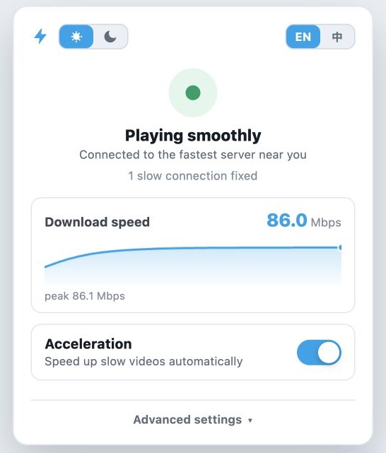
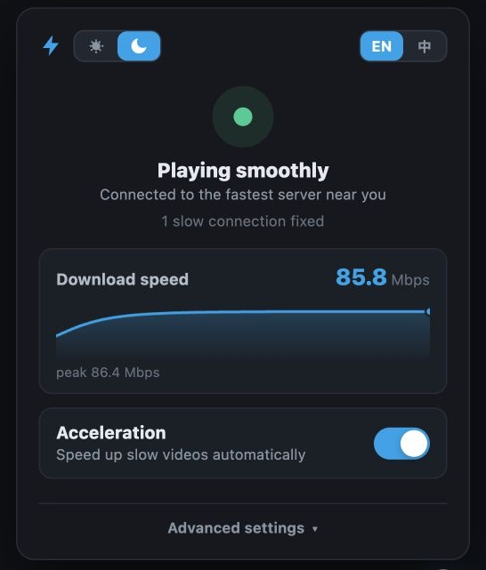

# Bilibili Accelerator

[中文](./README.md) · [Greasy Fork](https://greasyfork.org/en/scripts/582026-bilibili-accelerator) · v0.3.0

Watching Bilibili from outside mainland China, popular videos are usually fine. Everything else tends to land on a slow overseas mirror or an MCDN/PCDN node, and then it buffers every few seconds.

This userscript does one thing: before the player fetches a segment, it swaps those bad playback URLs for healthier official CDN hosts. Healthy CDN traffic is left alone.

| ☀️ Light | 🌙 Dark |
| :---: | :---: |
|  |  |

## Install

On Chrome, Edge, or Firefox, install [Tampermonkey](https://www.tampermonkey.net/) or [Violentmonkey](https://violentmonkey.github.io/) first, then grab the script from any of these:

- [Greasy Fork](https://greasyfork.org/en/scripts/582026-bilibili-accelerator) — recommended, auto-updates
- [Direct `.user.js`](https://update.greasyfork.org/scripts/582026/Bilibili%20Accelerator.user.js)
- [GitHub Raw fallback](https://raw.githubusercontent.com/realzza/bilibili-accelerator/main/dist/bilibili-accelerator.user.js)
- [GitHub Releases](https://github.com/realzza/bilibili-accelerator/releases/latest)

Reload any Bilibili tab you already had open. The ⚡ badge in the lower-right corner means it's running.

### Safari

Safari has no Tampermonkey, so use the [Userscripts](https://apps.apple.com/us/app/userscripts/id1463298887) extension:

1. Install Userscripts from the App Store.
2. Enable it in Safari Settings and allow access to `bilibili.com`.
3. Install the script from Greasy Fork or the GitHub Raw URL above.
4. Reload any open Bilibili tabs.

### Unpacked extension (Chrome / Edge)

If you'd rather not use a script manager, the repo also builds a Manifest V3 extension:

```sh
npm run build
```

Open `chrome://extensions`, turn on Developer mode, and load `dist/extension`.

## What it actually does

Bilibili returns several signed playback URLs for the same video. Overseas, the problematic ones look like this:

```text
upos-sz-mirrorcosov.bilivideo.com
xy153x35x231x78xy.mcdn.bilivideo.cn:8082
```

The script spots them before the request goes out and rewrites them to something like:

```text
upos-sz-mirrorcos.bilivideo.com
proxy-tf-all-ws.bilivideo.com
```

Detection isn't a hand-maintained domain blocklist. Odd ports, `os=mcdn`, the residential domains that `upos-*302*` redirects land on, and PCDN hosts wearing mirror-style names all count as slow. When Bilibili rotates to a new batch of PCDN domains, this usually keeps working without a change here.

A few other things happen by default:

- Candidate CDNs get probed for real, and the working order is cached per region. If you'd rather pin one host, Advanced settings has a fixed-server option.
- When playback keeps stalling, it rotates to another route — no reload, no losing your position.
- Live URLs (`/live-bvc/`) are never rewritten. Live and VOD run on separate CDN tiers, so a rewritten live URL simply won't play. Instead, obvious PCDN/MCDN entries are filtered out of the live room's server list, and at least one usable server always survives.
- `fetch`, `XMLHttpRequest`, in-page play data, and quality switches all run through the same rewrite path.

## Panel and settings

- The top of the panel shows status and how many connections were rewritten; below it is a live download-speed graph. When the CDN hides byte counts, it falls back to how many seconds are buffered ahead.
- Appearance follows the system theme. Once you pick the sun or moon in the header, that choice sticks.
- Advanced settings has seven accents: Bilibili Blue, Teal, Emerald, Violet, Pink, Sunset, and Graphite.
- **Still buffering? Boost harder** switches to the aggressive rewrite mode and reloads the page.
- The bandwidth guard is off by default. Turning it on blocks Bilibili's P2P SDK and WebRTC upload entry points; reload the page afterwards.
- In web fullscreen the ⚡ badge fades out. Move the pointer to the lower-right corner to bring it back.

## Releases

Full notes live in [Releases](https://github.com/realzza/bilibili-accelerator/releases).

| Version | What changed |
| --- | --- |
| [v0.3.0](https://github.com/realzza/bilibili-accelerator/releases/tag/v0.3.0) | Light/dark panel and seven accent themes; header theme and language share one sliding control. Acceleration untouched |
| [v0.2.3](https://github.com/realzza/bilibili-accelerator/releases/tag/v0.2.3) | Live streams no longer get rewritten; probes read real HTTP status; more hidden PCDN caught; stall recovery keeps rotating |
| [v0.2.2](https://github.com/realzza/bilibili-accelerator/releases/tag/v0.2.2) | Speed measured over the time data is actually flowing, so a full buffer no longer reads as 0 Mbps |
| [v0.2.1](https://github.com/realzza/bilibili-accelerator/releases/tag/v0.2.1) | Live download-speed graph in the panel, with a buffer-health fallback |
| [v0.2.0](https://github.com/realzza/bilibili-accelerator/releases/tag/v0.2.0) | Big one: behavioral slow-node detection, automatic server selection, stall recovery, EN/中 panel, optional bandwidth guard |
| [v0.1.3](https://github.com/realzza/bilibili-accelerator/releases/tag/v0.1.3) | Lightning-only badge, auto-hide in web fullscreen, stops covering the fullscreen button |
| [v0.1.2](https://github.com/realzza/bilibili-accelerator/releases/tag/v0.1.2) | Rebuilt the floating control and settings panel |
| [v0.1.1](https://github.com/realzza/bilibili-accelerator/releases/tag/v0.1.1) | First installable userscript release |

## Troubleshooting

Check for the ⚡ badge first. Tabs that were open during install or an update have to be reloaded.

If it still stalls, open Advanced settings, hit **Copy report**, and file an [issue](https://github.com/realzza/bilibili-accelerator/issues) with the video URL, your region, and what you saw. The report contains hostnames and rewrite reasons only — no signed media URLs or query tokens.

## Limits

- Browser player only. Apple TV and the native mobile apps are out of scope.
- CDN health varies by region and ISP. This routes around known-bad nodes; it can't fix regional licensing, a broken source file, or your local network.
- For why router-level proxying mostly doesn't help (and the certificate pinning problem on native apps), see [docs/router-proxy.md](docs/router-proxy.md).

## Development

```sh
npm test
npm run build
```

Build outputs:

```text
dist/bilibili-accelerator.user.js
dist/extension/
```

The version lives in `package.json` and nowhere else; the build stamps it into the userscript header and the extension manifest. `dist/` is committed, and CI checks it against `src/`, so rebuild before you commit.

## License

[MIT](./LICENSE)
