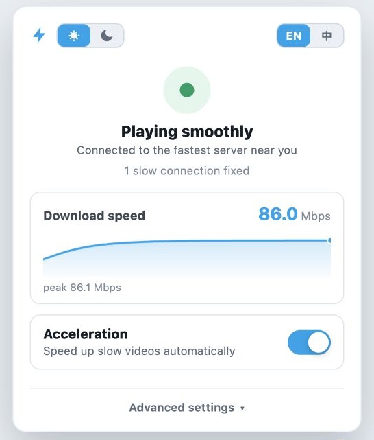
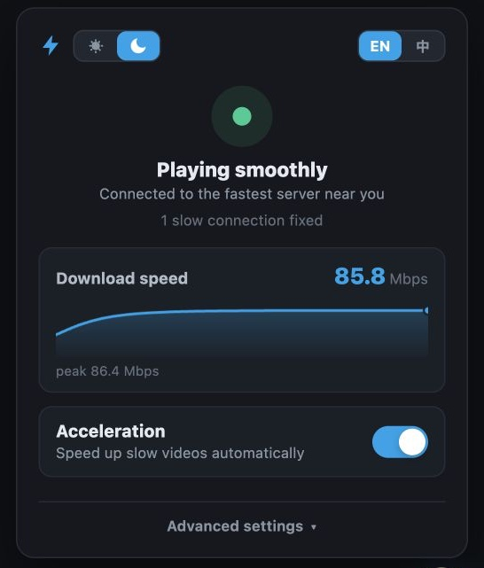

# &nbsp;Bilibili Accelerator

[English](./README.en.md) · [Greasy Fork](https://greasyfork.org/en/scripts/582026-bilibili-accelerator) · 当前版本 v0.5.0

海外看 B 站，热门视频一般没什么问题，冷门视频经常一会儿流畅、一会儿卡死。

这个用户脚本用来改善这种情况：它在浏览器里观察播放过程，遇到明显不稳的连接时自动调整，并把实时下载速度显示在面板上。播放正常时不会介入。

| ☀️ 浅色 | 🌙 深色 |
| :---: | :---: |
|  |  |

## 安装

Chrome / Edge / Firefox 先装 [Tampermonkey](https://www.tampermonkey.net/) 或 [Violentmonkey](https://violentmonkey.github.io/)，然后从下面任意一个地址装脚本：

- [Greasy Fork 脚本页](https://greasyfork.org/en/scripts/582026-bilibili-accelerator)（推荐，能自动更新）
- [直接安装 `.user.js`](https://update.greasyfork.org/scripts/582026/Bilibili%20Accelerator.user.js)
- [GitHub Raw 备用地址](https://raw.githubusercontent.com/realzza/bilibili-accelerator/main/dist/bilibili-accelerator.user.js)
- [GitHub Releases](https://github.com/realzza/bilibili-accelerator/releases/latest)

装完刷新一下已经打开的 B 站页面。右下角出现 ⚡ 就说明脚本跑起来了。

### Safari

Safari 上没有 Tampermonkey，用 [Userscripts](https://apps.apple.com/us/app/userscripts/id1463298887) 这个扩展：

1. 从 App Store 装 Userscripts。
2. 在 Safari 设置里启用它，并允许访问 `bilibili.com`。
3. 打开上面的 Greasy Fork 或 GitHub Raw 地址完成安装。
4. 刷新已经打开的 B 站页面。

### 本地扩展（Chrome / Edge）

不想用脚本管理器的话，仓库也能直接构建成 Manifest V3 扩展：

```sh
npm run build
```

然后打开 `chrome://extensions`，开启「开发者模式」，选择 `dist/extension`。

## 面板与设置

- 面板顶部是当前状态，下面是实时下载速度曲线。拿不到速度数据时，会退回显示前方缓冲了多少秒。
- 明暗跟随系统。点顶部的日 / 月开关之后，就变成你手动指定的浅色或深色。
- 高级设置里有 7 套主题色：哔哩蓝、青碧、翠绿、星紫、少女粉、落日橙、石墨灰。
- 状态栏注明当前使用的线路：原生线路（B 站为该视频分配的线路）或切换后的线路。实时速度只在下方的下载速度卡片中显示。
- 本视频卡过或线路速度不足时，面板提供「测试其他线路」：立即比较几条线路，只在明显更快时切换，不保存设置，也不刷新页面。
- 带宽保护默认关闭，开启后会限制页面占用你的上传带宽，需要刷新页面生效。
- 网页全屏时 ⚡ 会淡出，鼠标移到右下角就能重新唤出。

## 版本

完整说明见 [Releases](https://github.com/realzza/bilibili-accelerator/releases)。

| 版本 | 主要变化 |
| --- | --- |
| v0.5.0 | 线路改为按实测决定。每个视频先使用原生线路（B 站为该视频分配的线路），扩展测量播放器实际下载每个片段的速度；当前线路低于视频码率且缓冲不足时，在播放器接下来要用的数据上比较两条备选线路，切换到明显更快的一条并保持使用。卡住的片段经播放器自身的超时路径立即改由新线路重试。取消页面加载时的测速、6 小时排序缓存和卡顿时的逐个轮换：测速只读文件开头，实际测的是往返时延；排序对所有视频通用，而同一线路对热门与冷门视频的速度可相差十倍以上；轮换会逐步落到排序末尾的线路。Akamai 只使用 B 站下发的地址。「还在卡？再加把劲」改为不保存设置的「测试其他线路」，自动模式下不再显示「适用范围」和「改写 Akamai」 |
| [v0.4.1](https://github.com/realzza/bilibili-accelerator/releases/tag/v0.4.1) | 固定服务器改为下拉选择：原输入框在已有地址时只列出匹配的候选，须先清空才能看到其他服务器。列表改为自动模式实测的 8 个服务器，不再提供 Akamai（改写到 Akamai 的视频请求会返回 403），其他地址可通过「自定义…」填写。该设置仅在选择「使用固定服务器」后显示，自动模式下服务器由测速结果决定。高级设置中下拉框与输入框的文字左侧现已对齐 |
| [v0.4.0](https://github.com/realzza/bilibili-accelerator/releases/tag/v0.4.0) | 后台播放修复：切换至其他标签页后不再于数秒内卡住（Safari 最明显）。起因是加速器将 B 站自家的海外镜像改写至境内 CDN。候选服务器现覆盖境内外两档并全部参与实测，排序改为按实测吞吐而非应答时间，卡顿切换改为遍历完整列表。直播页的 ⚡ 图标也改为自动隐藏，不再遮挡弹幕栏 |
| [v0.3.0](https://github.com/realzza/bilibili-accelerator/releases/tag/v0.3.0) | 面板深浅色 + 7 套主题色；顶部主题 / 语言改成同一套滑动控件。核心逻辑没动 |
| [v0.2.3](https://github.com/realzza/bilibili-accelerator/releases/tag/v0.2.3) | 直播场景的稳定性修复；探测逻辑更准确；卡顿恢复会持续重试 |
| [v0.2.2](https://github.com/realzza/bilibili-accelerator/releases/tag/v0.2.2) | 速度曲线按「数据真正在传输的时段」算，缓冲填满时不再假装掉到 0 |
| [v0.2.1](https://github.com/realzza/bilibili-accelerator/releases/tag/v0.2.1) | 面板加上实时下载速度曲线，拿不到速度数据时退回显示缓冲时长 |
| [v0.2.0](https://github.com/realzza/bilibili-accelerator/releases/tag/v0.2.0) | 大改版：自动优化播放连接、卡顿自动恢复、中英文面板、可选带宽保护 |
| [v0.1.3](https://github.com/realzza/bilibili-accelerator/releases/tag/v0.1.3) | 悬浮图标改成纯 ⚡，网页全屏自动淡出，不再压住全屏按钮 |
| [v0.1.2](https://github.com/realzza/bilibili-accelerator/releases/tag/v0.1.2) | 悬浮控件和设置面板重做 |
| [v0.1.1](https://github.com/realzza/bilibili-accelerator/releases/tag/v0.1.1) | 首个可直接安装的用户脚本版本 |

## 遇到问题

先看右下角有没有 ⚡。刚装完或刚更新的话，已经开着的 B 站页面必须刷新一次。

Chrome / Edge 上一直没有 ⚡，Tampermonkey 还提示「script hasn't run yet」或让你打开「allow user scripts」——这是新版 Tampermonkey（Manifest V3）的规矩，浏览器要你手动放行一次才让它注入脚本，跟本脚本无关。开一下就好：

- **Chrome**：进 `chrome://extensions`，点开 Tampermonkey 的「详细信息」，把「允许用户脚本」打开。老版本没这个开关的话，把右上角「开发者模式」打开就行。
- **Edge**：进 `edge://extensions/`，先开左下角「开发人员模式」，再点开 Tampermonkey 的「详细信息」，把「允许用户脚本」打开。找不到这个开关的话是 Edge 太旧了，更新一下再看。

还是卡的话，打开「高级设置」→「复制诊断报告」，然后带上视频地址、你所在的地区和具体现象发到 [Issues](https://github.com/realzza/bilibili-accelerator/issues)。报告只包含必要的诊断信息，不含带签名参数的完整媒体地址。

## 限制

- 只管浏览器里的 B 站网页播放器，Apple TV 和手机 App 不在范围内。
- 网络状况本身就随地区和运营商变。脚本能改善一部分情况，但解决不了版权地区限制、源文件本身有问题，或者你本地网络的锅。
- 软路由方案为什么基本不管用（以及原生 App 的证书固定问题），见 [docs/router-proxy.md](docs/router-proxy.md)。

## 开发

```sh
npm test
npm run build
```

构建产物：

```text
dist/bilibili-accelerator.user.js
dist/extension/
```

版本号只在 `package.json` 里改，构建脚本会同步用户脚本头和扩展 manifest。`dist/` 是提交进仓库的，CI 会检查它和 `src/` 是否一致，所以提交前记得重新构建。

## License

[MIT](./LICENSE)
